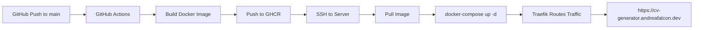

# DEPLOY.md

## Overview

This document describes the deployment strategy for the CV Generator application. The deployment is fully automated via GitHub Actions and uses Docker containers with Traefik as reverse proxy.

---

## Architecture



---

## GitHub Actions Workflow

The deployment is triggered automatically when code is pushed to the `main` branch.

### Workflow Steps

1. **Checkout Code**: Retrieves the repository code
2. **Setup Docker Buildx**: Prepares Docker build environment
3. **Login to GHCR**: Authenticates with GitHub Container Registry
4. **Build & Push**: Creates and pushes Docker image to `ghcr.io/falconandrea/cv-generator:main`
5. **Deploy**: Connects to production server via SSH and executes deploy script

### Required GitHub Secrets

Configure these secrets in your GitHub repository settings (`Settings → Secrets and variables → Actions`):

| Secret Name                 | Description                                              |
| --------------------------- | -------------------------------------------------------- |
| `PRODUCTION_SERVER_HOST`    | Server IP address or hostname                            |
| `PRODUCTION_SERVER_USER`    | SSH username (e.g., `ubuntu`)                            |
| `PRODUCTION_SERVER_SSH_KEY` | Private SSH key for server authentication                |
| `GHCR_USERNAME`             | GitHub username                                          |
| `GHCR_TOKEN`                | GitHub Personal Access Token with `write:packages` scope |

### Required GitHub Variables

Configure these variables in your GitHub repository settings (`Settings → Secrets and variables → Actions → Variables`):

| Variable Name              | Description                                 |
| -------------------------- | ------------------------------------------- |
| `NEXT_PUBLIC_API_ENDPOINT` | API endpoint URL (if needed)                |
| `NEXT_PUBLIC_ENV`          | Environment identifier (e.g., `production`) |

---

## Server Setup

### Prerequisites

The production server must have:

- Docker installed
- Docker Compose installed
- Traefik running with a `web` network
- SSH access configured
- Sufficient disk space for Docker images

### Traefik Configuration

The application uses Traefik as reverse proxy with the following features:

- Automatic HTTPS via Let's Encrypt
- HTTP to HTTPS redirect
- Certificate management
- Load balancing

### Network Configuration

Ensure Traefik has an external network named `web`:

```bash
docker network create web
```

### Server Setup Instructions

Follow these steps to set up the production server:

1. **Create the application directory**:

   ```bash
   mkdir -p /home/ubuntu/apps/cv-generator
   cd /home/ubuntu/apps/cv-generator
   ```

2. **Copy deployment files** (or let GitHub Actions do it automatically):

   The GitHub Actions workflow will automatically copy the following files from the `server/` directory:
   - `docker-compose.yml`
   - `deploy.sh`

   Alternatively, you can copy them manually:

   ```bash
   # From your local machine
   scp server/docker-compose.yml ubuntu@your-server:/home/ubuntu/apps/cv-generator/
   scp server/deploy.sh ubuntu@your-server:/home/ubuntu/apps/cv-generator/

   # On the server
   chmod +x /home/ubuntu/apps/cv-generator/deploy.sh
   ```

3. **Verify the setup**:

   ```bash
   cd /home/ubuntu/apps/cv-generator
   ls -la
   # You should see: docker-compose.yml and deploy.sh
   ```

4. **Test the deployment** (optional):

   ```bash
   # Pull the image manually to test
   docker pull ghcr.io/falconandrea/cv-generator:main

   # Start the container
   docker compose up -d

   # Check logs
   docker logs -f cv-generator
   ```

### Directory Structure

On the production server, the files are organized as follows:

```
/home/ubuntu/apps/
├── cv-generator/           # CV Generator application
│   ├── docker-compose.yml   # Docker Compose configuration
│   ├── deploy.sh            # Deployment script
│   └── .env                # Optional environment variables
├── otherproject.io/         # Other projects...
└── otherproject.com/      # Other projects...
```

In the repository, the deployment files are organized as:

```
/
├── .github/
│   └── workflows/
│       └── deploy.yml       # GitHub Actions workflow
├── server/                  # Server deployment files
│   ├── docker-compose.yml   # Docker Compose configuration
│   └── deploy.sh            # Deployment script
├── Dockerfile               # Docker image definition
└── docs/
    └── DEPLOY.md            # This file
```

---

## Docker Image

### Image Details

- **Registry**: `ghcr.io/falconandrea/cv-generator`
- **Tag**: `main` (for production)
- **Platform**: `linux/arm64` (adjust as needed for your server)

### Docker Build Process

The Dockerfile uses a multi-stage build:

1. **Base Stage**: Official Node.js image
2. **Dependencies Stage**: Installs npm dependencies
3. **Builder Stage**: Builds the Next.js application
4. **Runner Stage**: Optimized production image with minimal footprint

---

## Docker Compose Configuration

The `docker-compose.yml` file defines the service configuration:

### Service Configuration

- **Container Name**: `cv-generator`
- **Image**: `ghcr.io/falconandrea/cv-generator:main`
- **Restart Policy**: `unless-stopped`
- **Network**: `web` (Traefik network)

### Traefik Labels

Labels configure routing and SSL:

- HTTP to HTTPS redirect
- HTTPS router with Let's Encrypt certificates
- Service definition on port 3001
- DNS resolution for `cv-generator.andreafalcon.dev`

---

## Deployment Script

The `deploy.sh` script handles the server-side deployment:

### Script Actions

1. Pulls the latest Docker image from GHCR
2. Restarts the container using docker-compose
3. Forces recreation of the container

### Usage

The script is automatically executed by GitHub Actions after a successful build.

---

## Environment Variables

### Application Variables

The following environment variables can be configured:

| Variable   | Description      | Default      |
| ---------- | ---------------- | ------------ |
| `HOST`     | Bind address     | `0.0.0.0`    |
| `PORT`     | Application port | `3001`       |
| `NODE_ENV` | Node environment | `production` |

### Next.js Variables

| Variable                   | Description            | Required |
| -------------------------- | ---------------------- | -------- |
| `NEXT_PUBLIC_API_ENDPOINT` | API endpoint URL       | No       |
| `NEXT_PUBLIC_ENV`          | Environment identifier | No       |

---

## Troubleshooting

### Common Issues

#### Image Pull Fails

```bash
# Check if you're logged into GHCR
docker login ghcr.io

# Verify image exists
docker pull ghcr.io/falconandrea/cv-generator:main
```

#### Container Won't Start

```bash
# Check container logs
docker logs cv-generator

# Inspect container status
docker ps -a | grep cv-generator
```

#### Traefik Not Routing

```bash
# Check Traefik logs
docker logs traefik

# Verify network connectivity
docker network inspect web

# Check Traefik dashboard (if enabled)
```

#### SSL Certificate Issues

```bash
# Check Let's Encrypt certificates
docker exec traefik ls /letsencrypt/acme.json

# Force certificate renewal (if needed)
docker restart traefik
```

---

## Security Considerations

### Best Practices

1. **SSH Keys**: Use strong SSH keys and rotate them regularly
2. **Secrets**: Never commit secrets to the repository
3. **Network**: Use a dedicated Docker network for Traefik
4. **Updates**: Keep Docker and Traefik updated
5. **Access**: Limit SSH access to specific IP addresses

### Firewall Configuration

Ensure the following ports are accessible:

| Port | Protocol | Purpose         |
| ---- | -------- | --------------- |
| 22   | TCP      | SSH access      |
| 80   | TCP      | HTTP (Traefik)  |
| 443  | TCP      | HTTPS (Traefik) |

---

## Monitoring

### Health Checks

The application can be monitored via:

- Traefik dashboard (if enabled)
- Docker container logs
- Application logs

### Logs

```bash
# View container logs
docker logs -f cv-generator

# View last 100 lines
docker logs --tail 100 cv-generator

# View logs with timestamps
docker logs -t cv-generator
```

---

## Rollback Procedure

To rollback to a previous version:

1. Identify the previous image tag
2. Update `docker-compose.yml` with the previous tag
3. Run the deploy script

```bash
# Example rollback
docker pull ghcr.io/falconandrea/cv-generator:previous-tag
# Update docker-compose.yml tag
docker compose up -d --force-recreate
```

---

## File Structure

### Repository Structure

```
/
├── .github/
│   └── workflows/
│       └── deploy.yml          # GitHub Actions workflow
├── server/                     # Server deployment files
│   ├── docker-compose.yml       # Docker Compose configuration
│   └── deploy.sh                # Server-side deployment script
├── Dockerfile                   # Docker image definition
└── docs/
    └── DEPLOY.md                # This file
```

### Server Structure

```
/home/ubuntu/apps/
├── cv-generator/               # CV Generator application directory
│   ├── docker-compose.yml       # Copied from server/ directory
│   ├── deploy.sh                # Copied from server/ directory
│   └── .env                    # Optional environment variables
├── otherproject.io/              # Other projects...
└── otherproject.com/          # Other projects...
```

---

## References

- [GitHub Actions Documentation](https://docs.github.com/en/actions)
- [Docker Documentation](https://docs.docker.com/)
- [Traefik Documentation](https://doc.traefik.io/traefik/)
- [Next.js Deployment](https://nextjs.org/docs/deployment)
